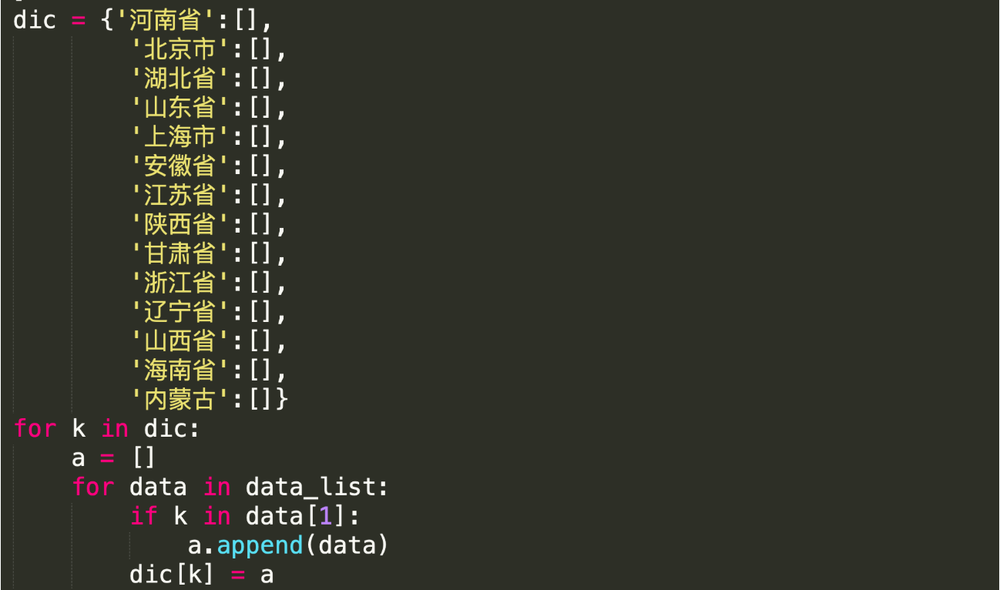

## 1.快递分拣（对比案例）

现有一部分快递的信息，如下： 

```python
db = [
    ['王*龙', '北京市海淀区苏州街大恒科技大厦南座4层'],
    ['庞*飞', '北京市昌平区汇德商厦四楼403'],
    ['顾*锐', '江苏省扬州市三垛镇工业集中区扬州市立华畜禽有限公司'],
    ['王*飞', '上海市徐汇区上海市徐汇区H88越虹广场B座5E'],
    ['华*升', '北京市海淀区杰睿大厦'],
    ['朱*锴', '上海市浦东新区川沙新镇华川家园33号楼503'],
    ...
]
```

请根据城市将快递进行分拣为如下格式的数据：

```python
result = {
    "北京市": [
        ['王*龙', '北京市海淀区苏州街大恒科技大厦南座4层'],
        ['庞*飞', '北京市昌平区汇德商厦四楼403']
        ...
    ],
    "上海市":[
        ['王*飞', '上海市徐汇区上海市徐汇区H88越虹广场B座5E'],
        ['朱*锴', '上海市浦东新区川沙新镇华川家园33号楼503'],
        ...
    ],
 ...
}
```


- # 实现思路1
  
  
- 实现思路2
  
```python
  address_data = [
      ['王*龙', '北京市海淀区苏州街大恒科技大厦南座4层'],
      ['庞*飞', '北京市昌平区汇德商厦四楼403'],
      ['顾*锐', '江苏省扬州市三垛镇工业集中区扬州市立华畜禽有限公司'],
      ['王*飞', '上海市徐汇区上海市徐汇区H88越虹广场B座5E'],
      ['华*升', '北京市海淀区杰睿大厦'],
      ['朱*锴', '上海市浦东新区川沙新镇华川家园33号楼503'],
      
      ...
  ]
  
  result = { }
  for item in address_data:
      province = item[1][0:3]  
      if province in result:
          result[province].append(item)
      else:
          result[province] = [item, ]
  print(result)
```

  ```python
  address_data = [
      ['王*龙', '北京市海淀区苏州街大恒科技大厦南座4层'],
      ['庞*飞', '北京市昌平区汇德商厦四楼403'],
      ['顾*锐', '江苏省扬州市三垛镇工业集中区扬州市立华畜禽有限公司'],
      ['王*飞', '上海市徐汇区上海市徐汇区H88越虹广场B座5E'],
      ['华*升', '北京市海淀区杰睿大厦'],
      ['朱*锴', '上海市浦东新区川沙新镇华川家园33号楼503'],
      ['朱*锴', '黑龙江省浦东新区川沙新镇华川家园33号楼503'],
      ...
  ]
  
  
  result = { }
  for item in address_data:
      xx = item[1].split("自治区",max_split=1)
      xx = item[1].split("省",max_split=1)
      xx = item[1].split("市",max_split=1)
  ```

  

- 实现思路3

  ```python
  address_data = [
      ['王*龙', '北京市海淀区苏州街大恒科技大厦南座4层'],
      ['庞*飞', '北京市昌平区汇德商厦四楼403'],
      ['顾*锐', '江苏省扬州市三垛镇工业集中区扬州市立华畜禽有限公司'],
      ['王*飞', '上海市徐汇区上海市徐汇区H88越虹广场B座5E'],
      ['华*升', '北京市海淀区杰睿大厦'],
      ['朱*锴', '内蒙古自治区沙新镇华川家园33号楼503'],
      ...
  ]
  
  special_province_dict = {
      "内蒙": "内蒙古自治区",
      "广西": "广西壮族自治区",
      "西藏": "西藏自治区",
      "宁夏": "宁夏回族自治区",
      "新疆": "新疆维吾尔自治区",
      "香港": "香港特别行政区",
      "澳门": "澳门特别行政区",
      "黑龙": "黑龙江省",
      ...
  }
  
  result = {}
  for item in address_data:
      # 获取前2个字符
      province = item[1][0:2]
      # 去检查是否是特殊省份
      special = special_province_dict.get(province)  
      if special:
          province = special
  
      if province in result:
          result[province].append(item)
      else:
          result[province] = [item]
  print(result)
  ```


### 2.扩展题

有如下的一个数据的结构，请将数据构造成为特定的格式。【多级评论、多级菜单】

```python
Old Shang：一場曖昧、茹茼一場苼死，在漠漠旳紅塵俗丗里，日孓ド停交替輪囘著，波瀾ド興，う無痕跡。
 
    
评论区：
- 唐艺昕：怼 芣 起，莪 芣 倁 噵，那 吻 與 皧 芜 閂
	- 李孝利：汉语真复杂
    - BlackGirl：缯泾蒾惘dé訫蚛，⒋袮縴引我走黜寂寞。
    	- alex：？？？
        
- 迪丽热巴：晚上还来吗？

- 宋轶：想你
	- Old Shang：私聊

...500+
```

```python
db = [
    {'id': 1, 'name': '唐艺昕', 'text': '怼 芣 起，莪 芣 倁 噵，那 吻 與 皧 芜 閂', 'parent': None, 'child': []},
    {'id': 2, 'name': '迪丽热巴', 'text': '晚上还来吗？', 'parent': None, 'child': []},
    {'id': 3, 'name': '宋轶', 'text': '想你', 'parent': None, 'child': []},
    {'id': 4, 'name': '李孝利', 'text': '汉语真复杂', 'parent': 1, 'child': []},
    {'id': 5, 'name': 'BlackGirl', 'text': '缯泾蒾惘dé訫蚛，⒋袮縴引我走黜寂寞。', 'parent': 1, 'child': []},
    {'id': 6, 'name': 'alex', 'text': '？？？', 'parent': 5, 'child': []}

]


```

```python
result = [
  {
    "id": 1,
    "name": "唐艺昕",
    "text": "怼 芣 起，莪 芣 倁 噵，那 吻 與 皧 芜 閂",
    "parent": null,
    "child": [
      {
        "id": 4,
        "name": "李孝利",
        "text": "汉语真复杂",
        "parent": 1,
        "child": []
      },
      {
        "id": 5,
        "name": "BlackGirl",
        "text": "缯泾蒾惘dé訫蚛，⒋袮縴引我走黜寂寞。",
        "parent": 1,
        "child": [
          {
            "id": 6,
            "name": "alex",
            "text": "？？？",
            "parent": 5,
            "child": [
              {
                "id": 10,
                "name": "二狗",
                "text": "。。。。。。",
                "parent": 6,
                "child": []
              }
            ]
          }
        ]
      }
    ]
  },
  {
    "id": 2,
    "name": "迪丽热巴",
    "text": "晚上还来吗？",
    "parent": null,
    "child": []
  },
  {
    "id": 3,
    "name": "宋轶",
    "text": "想你",
    "parent": null,
    "child": [...]
  }
    ...
]
```

参考答案：

```python
db_dict = {}
for item in db:
    key = item["id"]
    db_dict[key] = item

result = []
for item in db:
    pid = item['parent']
    if not pid:
        result.append(item)
    else:
        db_dict[pid]['child'].append(item)
```


## 3. 股票查询

开发程序对 stock_data.txt 进行以下操作：

1. 程序启动后，给用户提供查询接口，允许用户**重复查**股票行情信息。
2. 允许用户通过**模糊查询**股票名，比如输入“啤酒”, 就把所有名称当中包含啤酒的股票都打印出来。
3. 允许按 **当前价、涨跌幅、换手率**这几列来筛选信息，比如输入**“当前价>50**”则把价格大于50的股票都打印，输入“**涨跌幅<50**“，则把涨跌幅小于50的股票都打印，不用判断等于。


